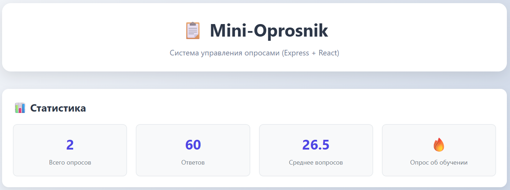
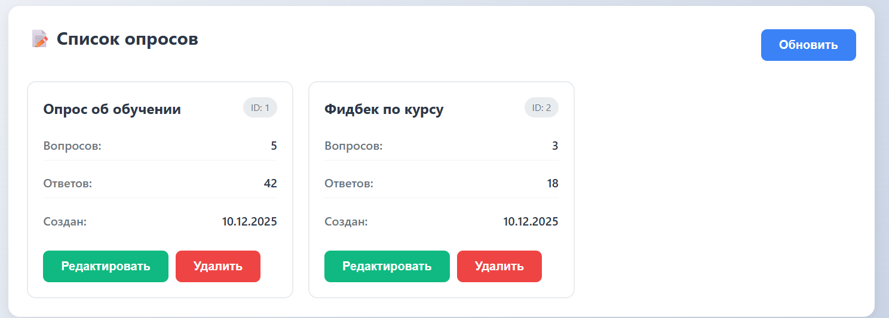

📋 Mini-Oprosnik
Управление опросами на Express + React

🖼️ Скриншоты приложения

Главная страница со статистикой и списком опросов

Форма создания нового опроса

Фильтрация опросов по различным критериям

🚀 Быстрый запуск
# 1. Установите зависимости
npm install
cd server && npm install

# 2. Запустите приложение
npm run dev
Приложение откроется:

Фронтенд: http://localhost:3000

Бэкенд: http://localhost:5000

📁 Структура проекта

my-react-app/
├── server/                 # Express бэкенд
│   ├── middleware/        # Кастомный middleware
│   ├── routes/           # API маршруты
│   ├── server.js         # Сервер
│   └── package.json
├── src/                  # React фронтенд
│   ├── App.jsx          # Главный компонент
│   └── App.css          # Стили
├── screenshots/         # Скриншоты приложения
├── package.json        # Основные скрипты
└── vite.config.js     # Настройка сборки

📡 API Endpoints
Метод	URL	Описание
GET	/api/surveys	Все опросы
GET	/api/surveys?title=поиск	Поиск опросов
GET	/api/surveys/:id	Один опрос
POST	/api/surveys	Создать опрос
PUT	/api/surveys/:id	Обновить опрос
DELETE	/api/surveys/:id	Удалить опрос
GET	/api/surveys/stats/summary	Статистика

🛠️ Технологии
Frontend: React, Vite, Axios

Backend: Express.js, CORS

Особенности: REST API, кастомный middleware, статические файлы

📝 Скрипты package.json

"scripts": {
  "dev": "concurrently \"npm run dev:backend\" \"npm run dev:frontend\"",
  "dev:frontend": "vite",
  "dev:backend": "cd server && npm run dev",
  "build": "vite build",
  "start": "npm run build && cd server && node server.js",
  "install-all": "npm install && cd server && npm install"
}

🎯 Что реализовано
✅ Express сервер с middleware
✅ REST API для CRUD операций
✅ React интерфейс с формами
✅ Фильтрация через query параметры
✅ Статистика в реальном времени
✅ Адаптивный дизайн

🔧 Настройка разработки
Установите Node.js (версия 16+)

Клонируйте проект

Запустите npm run install-all

Запустите npm run dev

📞 Пример запроса

# Создать опрос
curl -X POST http://localhost:5000/api/surveys \
  -H "Content-Type: application/json" \
  -d '{"title":"Мой опрос","questions":5}'

